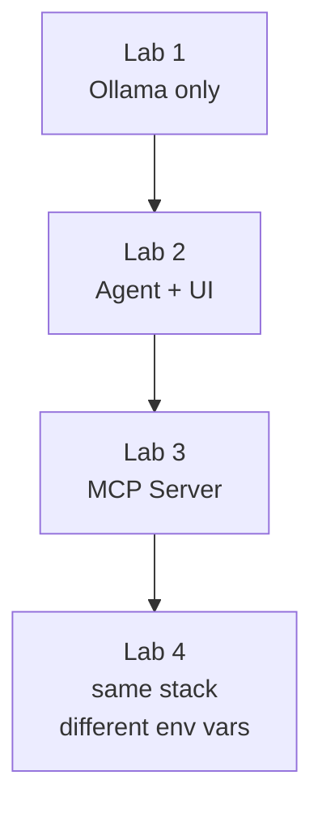

## Your session steps

Setup takes roughly 20–30 minutes: about 5 minutes to deploy the AKS cluster, plus the Kubernetes fundamentals walkthrough and installing the Lab 1 Helm chart.

1. Deploy a Managed Kubernetes Service (AKS) on Azure (about 5 minutes).

    - kubectl, Helm and jq are already installed on the bastion.

1. Run through the Kubernetes overview and concepts.

1. Deploy lab applications to the AKS cluster with Helm as each lab describes.

## Lab Stack overview

The lab application is four containers deployed to Kubernetes with Helm. Each lab adds one layer:

{}
The single configuration value that controls which LLM the agent talks to is
`OPENAI_BASE_URL`. By default it points at the local Ollama container. If you
want to route through FortiAIGate instead, that is the only value you change —
the agent image, MCP server, and UI are identical.
{}
