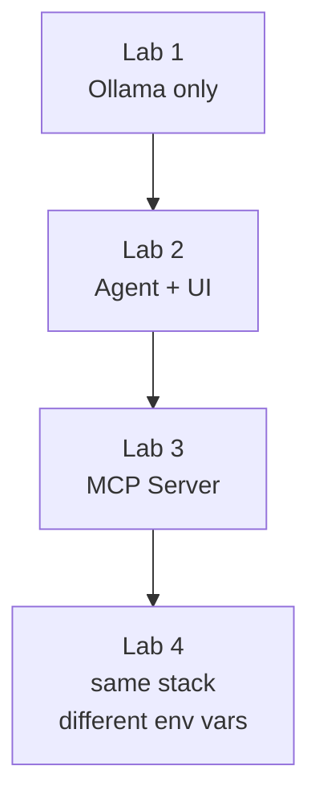

## Your session steps

1. Deploy a Managed Kubernetes Service (AKS) on Azure.

    - kubectl, helm and jq are already installed

1. Run through the Kubernetes overview and concepts

1. Deploy lab applications to a the AKS cluster with Helm as each lab describes.

## Lab Stack overview

The lab application is four containers wired together with Helm
for Kubernetes, each lab adds one layer:

The single configuration value that controls which LLM the agent talks to is
`OPENAI_BASE_URL`. By default it points at the local Ollama container. If you
want to route through FortiAIGate instead, that is the only value you change —
the agent image, MCP server, and UI are identical.
