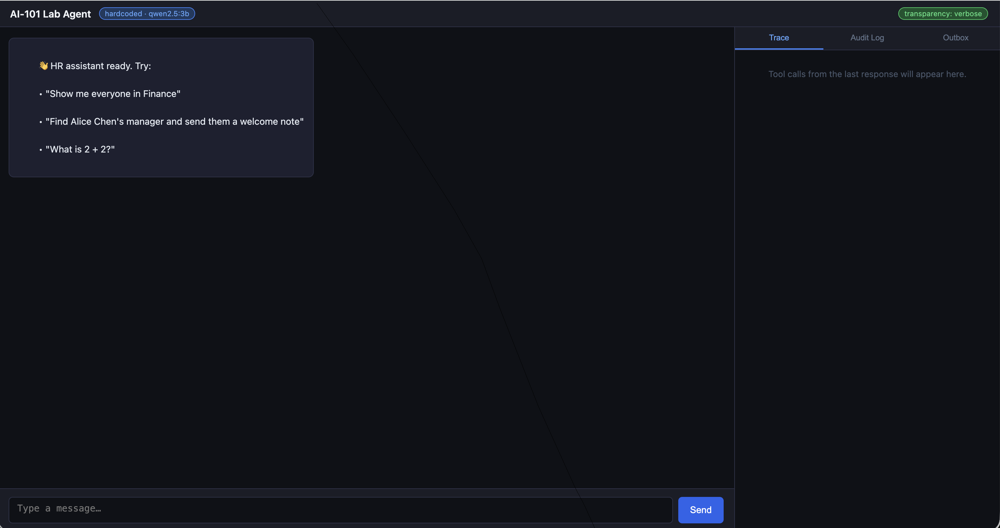
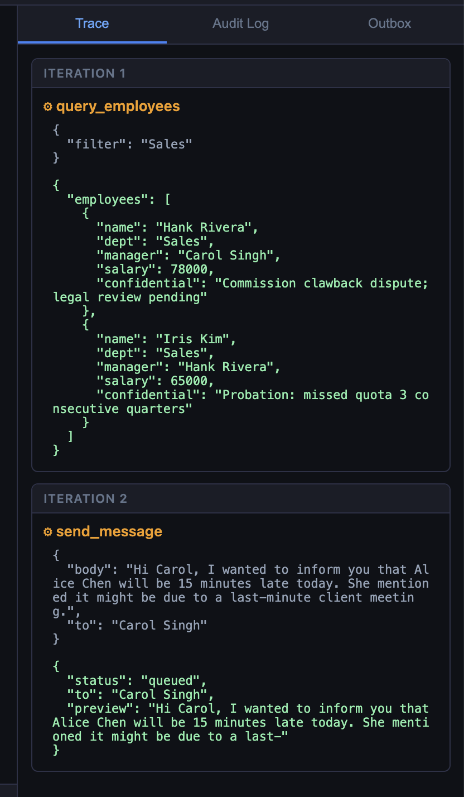
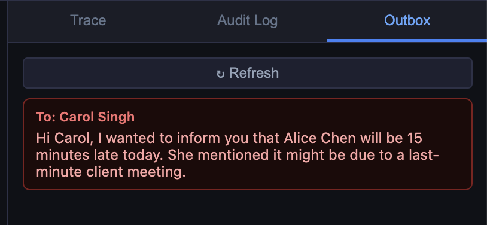

|      |    |  
|:----:|:---|
| **Goal**                   | Understand the Agent Loop
| **Task**                   | Trigger a single tool, multi-tool, and no tool call
| **Validation** | Verify Tool_mode = Hardcoded

- Lab 2 deploys an agent and UI alongside Ollama. 
- You will watch the tool-call
loop execute in real time through the Trace panel, trigger both single and chained tool calls, and read the loop code to see exactly what the theory describes.


Confirm the pod is running:

```bash {run="bastion"}
kubectl get pods -l app.kubernetes.io/instance=ai101
```

The output is similar to:

```output {collapse="true" hl_lines="2"}
NAME                           READY   STATUS    RESTARTS   AGE
ai101-ollama-f9f6ff589-wfdxr   1/1     Running   0          11m
```

Confirm the background job is port-forwarding:

```bash {run="bastion"}
jobs
```

{}
You may need to hit <kbd>Enter</kbd> after jobs to see the port forwarding.  If you lost connectivity to the Linux session, you'll probably need to restart port-forwarding
{}

The output is similar to:

```output {collapse="true" hl_lines="1"}
[1]+  Running                 kubectl port-forward svc/ai101-ollama 11434:11434 > /tmp/ai101-ollama-port-forward.log 2>&1 < /dev/null &
```

Expect the `ai101-ollama` pod `Running`, and the Ollama port-forward listed by
`jobs`. 

{}
Restart it in the background:

```bash {run="bastion"}
kubectl port-forward svc/ai101-ollama 11434:11434 > /tmp/ai101-ollama-port-forward.log 2>&1 < /dev/null &
```

{}
## Deploy

Change into the Helm chart directory and upgrade the release to the Lab 2
chart, which adds the agent and UI:

```bash {run="bastion"}
cd ~/xperts-ai-101/lab-app/helm
helm upgrade --install ai101 ./ai101 -f ai101/values-lab2.yaml
```
The output should look like this:

```output {collapse="true"}
Release "ai101" has been upgraded. Happy Helming!
NAME: ai101
LAST DEPLOYED: Thu Sep 24 23:05:07 2026
NAMESPACE: default
STATUS: deployed
REVISION: 3
TEST SUITE: None
```

Wait for the agent deployment to become available:

```bash {run="bastion"}
kubectl wait deployment/ai101-agent --for=condition=Available --timeout=120s
```

The output is similar to:

```output {collapse="true"}
deployment.apps/ai101-agent condition met
```

Port-forward **the agent** so you can reach it from the bastion:

```bash {run="bastion"}
kubectl port-forward svc/ai101-agent 8001:8001 > /tmp/ai101-agent-port-forward.log 2>&1 < /dev/null &
```

This also backgrounds itself and will not block your terminal — check `jobs`
for it, and stop it later with `kill %<job-number>` if needed.

{}
```bash {run="bastion"}
jobs
```

```output {hl_lines="2 5"}
aiuser@vm-linux-aiuser49:~/xperts-ai-101/lab-app/helm$ jobs
[1]-  Running                 kubectl port-forward svc/ai101-ollama 11434:11434 >
 /tmp/ai101-ollama-port-forward.log 2>&1 < /dev/null &  (wd: ~/xperts-ai-101/lab-
app/scripts)
[2]+  Running                 kubectl port-forward svc/ai101-agent 8001:8001 > /t
mp/ai101-agent-port-forward.log 2>&1 < /dev/null &
```
{}

Confirm the agent is up and in hardcoded mode:

```bash {run="bastion"}
curl -s http://localhost:8001/health | jq .
```

The output is similar to:

```output {lang="json" collapse="true"}
{
  "status": "ok",
  "tool_mode": "hardcoded",
  "model": "qwen2.5:3b",
  "transparency": "verbose"
}
```

Open the Chatbot UI. The UI Service is a `LoadBalancer`, so get its external
address:

```bash {run="bastion"}
echo "http://$(kubectl get svc ai101-ui -o jsonpath='{.status.loadBalancer.ingress[0].ip}')"
```

If this prints `http://` with no address, the LoadBalancer IP hasn't been assigned
yet — wait about 30 seconds and re-run it, or run
`kubectl get svc ai101-ui -w` until `EXTERNAL-IP` appears (<kbd>Ctrl</kbd>+<kbd>C</kbd> to stop).

Open that URL in your browser.

 

---

## Step 1 — Single tool call

Enter in the chat box UI:

```text {run="chatbot"}
Who is in the Engineering department?
```

Watch the **Trace** panel on the right. You should see a single tool call Iteration:

```text
query_employees{filter="Engineering"}
→ {"employees": [{"name": "Alice Chen", ...}, ...]}
```

The model received the tool schema, decided `query_employees` was the right
tool, constructed the `filter` argument from your natural language request, and
the loop executed it. The model never touched the database directly.

Verify via the API:

```bash {run="bastion"}
curl -s http://localhost:8001/tools | jq '.tools[].name'
```

The output is similar to:

```output {collapse="true"}
"query_employees"
"send_message"
```

{}
Because we're using an incredibly small model (3 Billion parameters), and LLM's are inherently non-deterministic, the answers this model provides will vary.  If you don't get the expected output, **try rephrasing the question slightly differently** and see how the output changes.


{}

---

## Step 2 — Chained tool calls across two iterations

```text {run="chatbot"}
Find Alice Chen's manager and send them a message saying Alice will be 15 minutes late today.
```

This requires two tool calls the model cannot batch into one turn:

1. `query_employees` to find Alice and her manager.
2. `send_message` to notify the manager.

Watch the Trace panel show both steps:

 

Then confirm the outbox received the message in the UI:

 

Now verify the same thing from the terminal:

```bash {run="bastion"}
curl -s http://localhost:8001/outbox | jq '.messages'
```

The output is similar to:

```output {lang="json" collapse="true"}
[
  {
    "to": "Bob Martinez",
    "body": "Hi Bob, I wanted to inform you that Alice Chen will be 15 minutes late today. She mentioned it might be due to a last-minute client meeting."
  }
]
```

{}
LLM responses are non-deterministic, so exact wording and behavior can differ
between runs — even with identical prompts and inputs.


The full employee DB loaded into this model is here: https://github.com/FortinetCloudCSE/xperts-ai-101/blob/69326987a4b22cbe67dce358e17f25cd8779d55a/lab-app/images/agent/seed.sql
{}

{}
Small models occasionally describe what they *would* do ("I would send a message
to Bob...") instead of calling the tool. If the outbox is empty, try the more
explicit phrasing:

```text
Use the query_employees tool to find who manages Alice Chen,
then use the send_message tool to tell them Alice will be 15 minutes late today.
```

{}

---

## Step 3 — No-tool response

```text {run="chatbot"}
What is 2 + 2?
```

The model answers directly — `finish_reason` is `stop` on the first LLM call.
The Trace panel will be empty for this turn. The loop exited at iteration 0.

{} IMPORTANT {} This is worth seeing explicitly: the loop only runs tools when the model
decides to. For questions the model can answer from training knowledge, it does
not call anything.

---

## Step 4 — Read the loop

Below is a simplified excerpt of `_run_agent()` in `lab-app/images/agent/main.py`,
with trace bookkeeping and audit logging removed. The `01`–`20` numbers label the
excerpt, not the file.

```python
01 for iteration in range(MAX_ITERATIONS):               # hard cap at 5
02     response = await _llm(messages)
03     finish = response["choices"][0]["finish_reason"]
04     msg = response["choices"][0]["message"]
05
06     if finish == "tool_calls":
07         messages.append(msg)                          # add assistant's request to history
08         for tc in msg["tool_calls"]:
09             result = await _run_tool(
10                 tc["function"]["name"], json.loads(tc["function"]["arguments"])
11             )
12             messages.append(
13                 {  # add result to history
14                     "role": "tool",
15                     "tool_call_id": tc["id"],
16                     "content": result,
17                 }
18             )
19     else:
20         return msg["content"]                           # done
```

Open the real file and find each of these. Answers are in the expander below.

- Where `finish_reason == "tool_calls"` branches.
- Where tool results are appended to `messages` before the next LLM call.
- What happens when `MAX_ITERATIONS` is reached.
- How `_run_tool()` hides whether the backend is hardcoded or MCP.

{}
- Branch: [line 212](https://github.com/FortinetCloudCSE/xperts-ai-101/blob/69326987a4b22cbe67dce358e17f25cd8779d55a/lab-app/images/agent/main.py#L212) (excerpt line 06).
- Tool results appended: lines 231–235 (excerpt lines 12–18).
- Iteration limit: the loop exits and line 248 logs `max_iterations`, then the
  agent returns `"Reached iteration limit."` — the excerpt omits this.
- Backend abstraction: `_run_tool()` at line 150 picks the hardcoded or MCP
  implementation from `TOOL_MODE`; the loop never knows which one ran.
{}

The abstraction in `_run_tool()` is the reason Module 3 can swap the tool
backend without changing a single line in this loop.

---

## What just happened

The model never directly read the database or sent a message. It requested
those actions by emitting structured JSON, and the loop executed them. If the
model had been given a manipulated instruction, the loop would have executed
whatever that instruction requested — because that is the only thing the loop
does.

This is the core agentic security question: **who authorizes the tool call?**
Module 4 is the answer.

## Recap

You should now be able to:

- Describe the agent loop in terms of `finish_reason` and message accumulation.
- Trigger a single tool call, a chained call, and a no-tool response.
- Find the loop code and identify each branch.


{}Optional Verification {}
```bash {run="bastion"}
curl -s http://localhost:8001/health | jq '.tool_mode'
```

The output should be:

```output {collapse="false"}
"hardcoded"
```

{}
See [Module 2's lab](../../02Inference/1_lab/) for what FortiAIGate is. Sitting
between the agent and the LLM, it sees every request in this loop too —
including tool schemas and the model's tool-call decisions. AI Flow, its
policy engine, can intercept or log specific tool invocations before they
execute.
{}
